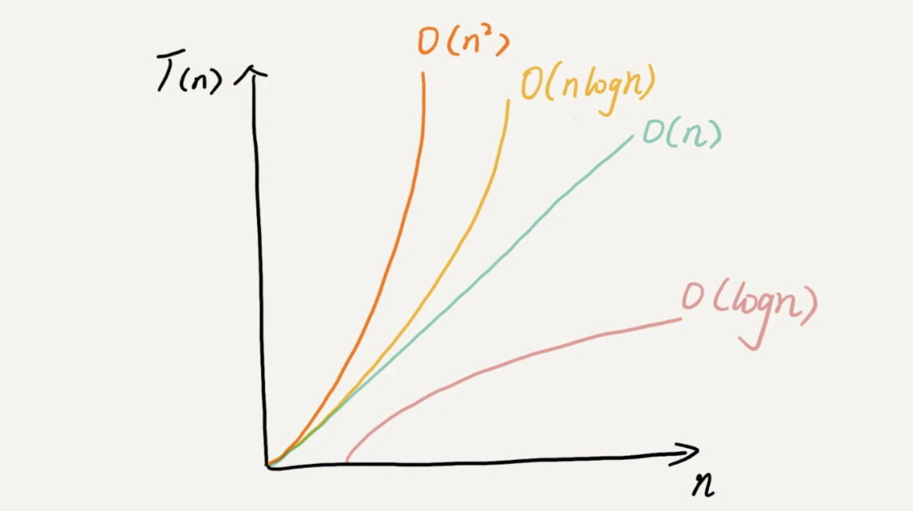

# 时间复杂度分析
## 时间复杂度分析
1. **只关注循环执行次数最多的一段代码**

​	在分析一个算法、一段代码的时间复杂度的时候，也只关注循环执行次数最多的那一段代码就可以了。这段核心代码执行次数的 n 的量级，就是整段要分析代码的时间复杂度。

举例：

```java
 1 int cal(int n) {
 2  int sum = 0;
 3  int i = 1;
 4  for (; i <= n; ++i) {
 5    sum = sum + i;
 6  }
 7  return sum;
 8}

```

其中第 2、3 行代码都是常量级的执行时间，与 n 的大小无关，所以对于复杂度并没有影响。循环执行次数最多的是第 4、5 行代码，所以这块代码要重点分析。前面我们也讲过，这两行代码被执行了 n 次，所以总的时间复杂度就是 O(n)。

2. **加法法则：总复杂度等于量级最大的那段代码的复杂度**

举例：

```java
1 int cal(int n) {
2   int sum_1 = 0;
3   int p = 1;
4   for (; p < 100; ++p) {
5     sum_1 = sum_1 + p;
6   }
7 
8   int sum_2 = 0;
9   int q = 1;
10   for (; q < n; ++q) {
11     sum_2 = sum_2 + q;
12   }
13 
14   int sum_3 = 0;
15   int i = 1;
16   int j = 1;
17   for (; i <= n; ++i) {
18     j = 1; 
19     for (; j <= n; ++j) {
20       sum_3 = sum_3 +  i * j;
21     }
22   }
23 
24   return sum_1 + sum_2 + sum_3;
25 }
```

这个代码分为三部分，分别是求 sum_1、sum_2、sum_3。我们可以分别分析每一部分的时间复杂度，然后把它们放到一块儿，再取一个量级最大的作为整段代码的复杂度。

第一段的时间复杂度是多少呢？这段代码循环执行了 100 次，所以是一个常量的执行时间，跟 n 的规模无关。

这里我要再强调一下，即便这段代码循环 10000 次、100000 次，只要是一个已知的数，跟 n 无关，照样也是常量级的执行时间。当 n 无限大的时候，就可以忽略。尽管对代码的执行时间会有很大影响，但是回到时间复杂度的概念来说，它表示的是一个算法执行效率与数据规模增长的变化趋势，所以不管常量的执行时间多大，我们都可以忽略掉。因为它本身对增长趋势并没有影响。

那第二段代码和第三段代码的时间复杂度是多少呢？答案是 O(n) 和 O(n2)，你应该能容易就分析出来，我就不啰嗦了。

综合这三段代码的时间复杂度，我们取其中最大的量级。所以，整段代码的时间复杂度就为 O(n2)。也就是说：**总的时间复杂度就等于量级最大的那段代码的时间复杂度**。那我们将这个规律抽象成公式就是：

如果 T1(n)=O(f(n))，T2(n)=O(g(n))；那么 T(n)=T1(n)+T2(n)=max(O(f(n)), O(g(n))) =O(max(f(n), g(n))).

3. **乘法法则：嵌套代码的复杂度等于嵌套内外代码复杂度的乘积**


**内容小结**

​	复杂度也叫渐进复杂度，包括时间复杂度和空间复杂度，用来分析算法执行效率与数据规模之间的增长关系，可以粗略地表示，越高阶复杂度的算法，执行效率越低。常见的复杂度并不多，从低阶到高阶有：O(1)、O(logn)、O(n)、O(nlogn)、O(n2 )


